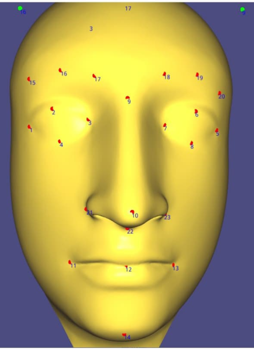
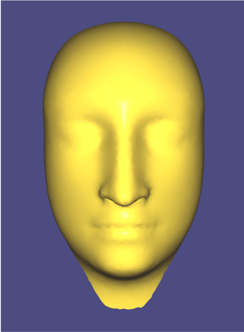
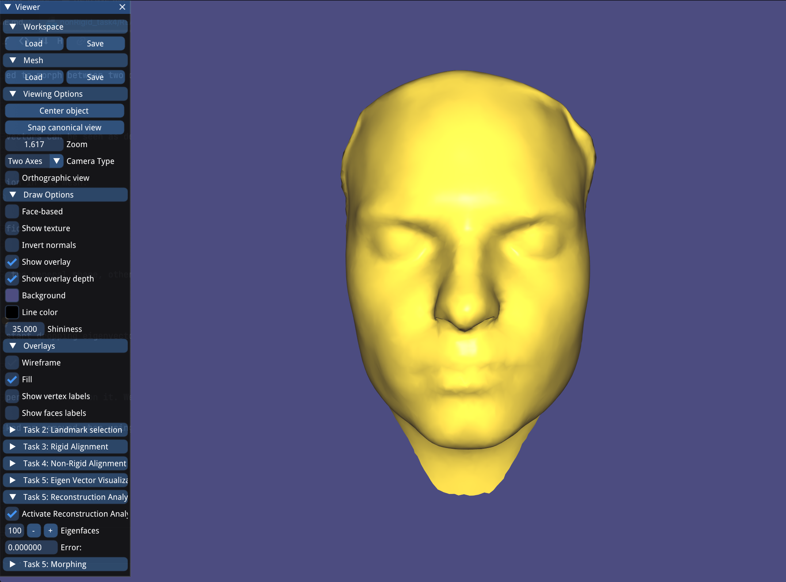
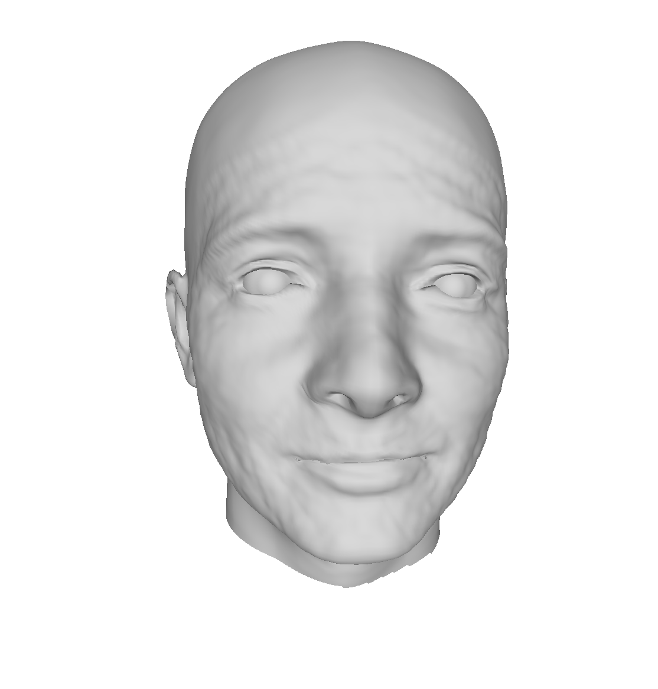
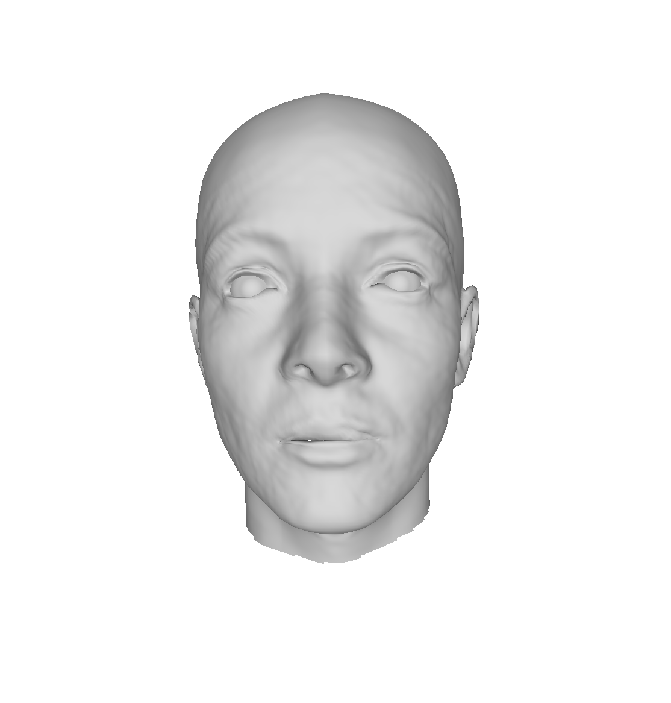

# Shape Modeling and Geometry Processing - Final Project

## Division of Work

- Agon Serifi: PCA & Bonus 1

- Andreas Aeberli: Landmark Extraction & Bonus 2

- Elham Amin Mansour: Warping & Presentation

- Lea Reichhardt: Warping & Combining Tasks

- Martina Kessler: Rigid Alignment

## Data

The data can be found in ``allTasksExceptLandmarks/data/``

## Landmark Extraction

#### Implementation

I created a landmark picker which lets one select an arbitrary amount of landmarks. You can click on any point on the mesh and using the baryonic coordinate weights it pickes the vertice closest.

#### Results

Meshes don't change, but points can be selected according to plan.

Visualized in the picker you can confirm the selected landmarks.

#### Manual

First go into the landmarks folder and:

mkdir build

cd build

cmake ..

make

./landmarks

If in the landmark picker, press 'S' to go into selection mode.
If clicking anywhere on the mesh the selected vertice will be colored grey.
To affirm your choice of landmark press 'A'
The greyed vertex will turn red and a label will be displayed.
Proceed to add next vertex. We defined 23 landmarks to describe our meshes.
Once all 23 where selected one presses 'Export Landmarks'-Button.
A filename_landmark file will be created in the data folder.

## Instructions for running the following sections:

First go into the allTasksExceptLandmarks folder and:

mkdir build

cd build

cmake -DCMAKE_BUILD_TYPE=Release ..

make

./allTasksExceptLandmarks

## Rigid Alignment

#### Implementation

The aim of the rigid alignment is to align the scanned face and the template face as good as possible using a similarity transformation. We decided to align the scanned faces to the template face and not the other way around because for the PCA all the warped template faces should be aligned in the same way.

To start, all the vertices of the scanned face are centered such that the mean of all landmark positions of the scan is zero.

The scaling factor is determined such that the mean distance to the mean of all landmarks is equal for both the target and the source landmarks. To find this scaling factor, the mean landmark position mean_lm_scan and mean_lm_template is calculated for both the scan and the template separately. Then the mean distance from all landmark positions lm_i_scan to mean_lm_scan is calculated for the scan. The same is done for the template. The goal is to find the scaling factor S such that the mean distance from all the landmark points to mean_lm is the same for the scan and the template.

The vertex positions of the scan are then multiplied by the scaling factor.

The optimal rotation is determined using https://igl.ethz.ch/projects/ARAP/svd_rot.pdf and the vertex positions of the scan are rotated according to the optimal rotation.

Then those vertices are translated back by the mean of the landmark vertex positions of the scan.

#### Results

From left to right: template face, scanned face, template and scanned face overlaid. The landmarks of the template are shown as red dots, the landmarks of the scan are shown as cyan dots. Not all landmarks can be seen because some are behind the surface of the face. It can be seen that the template and the scanned face are nicely aligned.

In the following screenshots the mean landmark of the scan and the template is shown in pink. It lies behind the surface of the face, therefore the meshes are shown from the inside. See the next screenshot for a better visualization with inverted normals. It can be seen that the mean landmark of both the template and the scan lie exactly on top of each other after the alignment.

Here the same is shown as above, but with inverted normals for a better visualization.

#### Manual

To perform rigid alignment of a single face press the button "Perform rigid alignment". For the visualization of the result, the Mesh type can be chosen between "Scan", "Template" and "Scan & Template Overlaid". 

To perform rigid alignment of all the faces press the button "Align All". The results are automatically stored in the folder "rigidAlignedFaces".

## Warping

#### Implementation

As proposed in the tutorial slides, we used the following energy function to perform the warping:

   
<small>(Image taken from tutorial slides)</small>  

To solve this energy minimization problem, we solved the following system using the SimplicialCholesky solver by Eigen:

   
<small>(Image taken from Github Issues)</small>  

<i>L_cot:</i> unweighted cotangent Laplacian   
<i>C_s:</i> weights for static constraints (boundary, landmarks)  
<i>C_ws:</i> weighted coordinates for static constraints (original boundary, target landmarks)  
<i>C_d:</i> weights for dynamic constraints (vertices close enough to target face)  
<i>C_wd:</i> weighted coordinates for dynamic constraints (points on target)  
<i>x':</i> unknown warped positions  
<i>x:</i> known rigidly aligned positions  

 We distinguish between static and dynamic constraints: we use the landmark points and the template boundary loop as static constraints. We first perform one or more warping iterations using only those constraint points (see results below) to roughly warp the key elements of the face such as eyes and mouth to the correct positions. In the next warping phase, we add the dynamic constraints to our constraint point set: the dynamic constraints are the points on the template that are very close to the scanned face. We can find the dynamic constraint efficiently with spatial index searches. We perform multiple warping iterations using both the static and the dynamic constraints, where the dynamic constraints are updated for every iteration (see results below).   

 We created several useful classes such as a <b>LandmarkLoader</b> class that provides functionality to parse and load the landmark text files, a <b>ConstraintPoints</b> class that computes the three different kinds of constraints: boundary, landmark, and dynamic closepoint constraints. Also, we created a polished version of our Spatial Index from assignment 2 and created the <b>SpatialIndex</b> class to speed up the dynamic computation of the closepoint constraints. 
 Moreover, we computed additional template meshes with different resolutions to allow a faster computation of the PCA in task 5. For that, we created the class <b>DecimateTemplate</b> which contains functionality to decimate the high resolution template and save the lower resolution result.

#### Results
red: landmark constraints  
blue: boundary constraints  
green: closepoint constraints  

We used a value of lambda=0.5 to produce the following results.  
<table>
   <tr>
    <td><b>Lower Resolution Template</b></td>
  </tr>
    <tr>
    <td>Template</td>
    <td>After 5 Iterations with <b style="color:red;">landmark</b>  and <b style="color:blue;">boundary</b> constraints</td>
    <td>After 5 additional iterations with  <b style="color:red;">landmark</b> + <b style="color:blue;">boundary</b>  + <b style="color:green;">closepoint</b> constraints</td>
    <td>Scan</td>
  </tr>
  <tr>
    <td></td>
    <td></td>
    <td></td>
    <td></td>
  </tr>
  <tr>
    <td></td>
    <td></td>
    <td></td>
    <td></td>
  </tr>
  <tr>
    <td></td>
    <td></td>
    <td></td>
    <td></td>
  </tr>
</table>

<table>
   <tr>
    <td><b>High Resolution Template</b></td>
  </tr>
    <tr>
    <td>Template</td>
    <td>After 5 Iterations with <b style="color:red;">landmark</b>  and <b style="color:blue;">boundary</b> constraints</td>
    <td>After 5 additional iterations with  <b style="color:red;">landmark</b> + <b style="color:blue;">boundary</b>  + <b style="color:green;">closepoint</b> constraints</td>
    <td>Scan</td>
  </tr>
  <tr>
    <td></td>
    <td></td>
    <td></td>
    <td></td>
  </tr>
  <tr>
    <td></td>
    <td></td>
    <td></td>
    <td></td>
  </tr>
  <tr>
    <td></td>
    <td></td>
    <td></td>
    <td></td>
  </tr>
</table>

#### Manual

To perform the non-rigid alignment, first load the necessary data using the "Load Data" Button in the Task 4 section of the GUI. Of course it is possible to perform the non-rigid alignment automatically on all faces using predefined parameters that we set in our implementation. Our choice for the lambda, the closepoint threshold and the number of static and dynamic iterations is based on thorough testing and provides a good result for most of the faces. This can be done with the "Compute All" button. The non-rigidly aligned faces will also be stored automatically in the folder <tt>data/nonRigidFaces</tt>. This is our predefined setting of the variables if we warp all the faces using the lower resolution template:  
lambda = 0.5, closepoint_thresh = 0.05, static_iterations = 2, dynamic_iterations = 20  
 Alternatively, we provide the option the go through all the iteration steps yourself on an examplary demo face. The GUI options for the closepoint threshold, lambda, and number of iterations will be used as parameters in this case. Furthermore, the Constraints Mode option can be used to decide whether to perform an iteration with only the static constraints (LANDMARK_BOUNDARY), or with the dynamic constraints as well (UPDATE_CLOSEPOINT). To perform an iteration, click the button "Iteration Demo".
 The Visualization Mode option provides several visualizations to have a look at the current state of the warping, constraint points, and the scanned face for comparison.

## PCA

#### Implementation

We perform PCA by computing an SVD of a mesh matrix. For this, we first create a data matrix $X$ consisting of all meshes where we flatten the vertices.
Instead of computing the covariance matrix of $X$ we perform an SVD on $X$ such that we get $X = UEV^{T}$.
This decomposition gives us the orthogonal matrix V which holds the eigenvectors, and one can easily show that E contains the square roots of the eigenvalues of the covariance matrix of X.

Given our PCA of X, we implemented three different tools that allow us to play around with the model.

1. Eigenvector Visualization
   * This section shows the first 10 Eigenvectors of the decomposition. The user can play around with the coefficients which are hard-constraint to +-100. Setting all eigenvalues to 0 results in the mean mesh. 
   * Further this section allows projecting a loaded mesh to the visualized Eigenvectors such that one can apply deformations from a specific initial point.
   
2. Reconstruction Analysis
   * The more Eigenvectors we keep "alive" the more we can reconstruct the mesh details. Reducing the number of Eigenvectors used and therefore compressing the model results in some reconstruction error. This error is computed in form of the mean squared loss of vertex positions. The shown mesh helps to get a visual feeling about the error.
   
3. Morphing
   * A mesh in a PCA basis is determined by a few coefficients. This can be used to morph between two different faces. This part allows setting up two meshes and interpolate between their corresponding coefficients which results in a smooth morphing. 

#### Results
1. Eigenvector Visualization
* PCA - Mean Mesh. The PCA is performed on the centered data matrix. The Eigenvectors can be seen as deformations on top of the mean mesh. Therefore, setting all eigenvectors to 0 results in this mean mesh.
   
  
* We now can set some coefficients for each eigenvector and observe a deformation in the mesh.

* The GUI allow also to project the loaded mesh to the mapped eigenvector coefficients.

  
* We can try to give each eigenvector a meaning. Some eigenvectors will change the general shape, others will have a larger effect on specific parts like the nose. We found EV7 and EV8 to have a influence in the smiling of a mesh. Given the projected coefficients we can set these eigenvectors manually and observe a slightly smiling version.  

  
2. Reconstruction Analysis
* Keeping manny Eigenvectors results in a more accurate reconstruction. If we start dropping eigenvectors we loose high frequent details and finally get the mean mesh.

 Eigenvectors           | 100           | 30             |  10 | 0|
:-------------------------:|:-------------------------:|:-------------------------:|:-------------------------: |:-------------------------: 
Reconstruction |   |   |  | 

3. Morphing
* We can interpolate the coefficients for the PCA basis of two meshes, which allows for a smooth morphing.

#### Manual

* Before starting with the different Tools one has first to Load the data and perform the PCA on it. We created two buttons in the "Task 5: Eigen Vector Visualization" which have to be run one after the other.
* Then one can use the 3 tools
* Each tool contains at the beginning a checkbox. This checkbox has to be checked or removed when using or leaving the tool.

## Bonus 1: Multi-Linear Face Model

#### Implementation

We implemented an MLM motivated by [Vlasic et al](https://vcg.seas.harvard.edu/publications/face-transfer-with-multilinear-models/paper).

The MLM decomposes a face tensor using a Tucker Decomposition, which can be described as a three-mode PCA and can be generalized to higher orders analysis as HO-SVD.
By ordering the meshes according to the identity and expression into tensors. Performing then a Tucker decomposition allows us to decouple the identity from the expression. For this part, we used [TensorLy](http://tensorly.org/stable/index.html), and Open Source python library for tensor operations.
We show how an MLM model can as well morphe between different faces just by changing the identity factor. Additionally, we show how the model can generate new subjects by sampling the identity factor and control the expression by using the smiling expression.
A strong MLM (many subjects and many expressions per subject) can be used to fill missing data or clean broken meshes. Unfortunately, the given course data does not provide a large variety of expressions.

In the context of Deep Learning, a more involved face model like this MLM is often used. The decoupling ability can be used for facial performance retargeting or identity reconstruction from video footage. 

#### Results

* As in the single PCA model we can perform morphing between different identities. For moving between two identities the MLM only has to change the identity factor and keeps the expression factor the same.

* Next we keep the expression factor fixed towards the smiling. We now can sample new identity vectors and observe many new meshes all smiling. This shows 100 sampled identities:

#### Manual

In the folder `BonusMLM/` we created a Jupyter notebook called `MLM_Playground.ipynb` which gives easy access to the model and show cases the different tasks.
For computing MLMs on own data follow the instructions in `BonusMLM/README.md`

## Bonus 2: Learning-based landmark optimization

#### Implementation

There was no time for training a ML model ourself so we checked how to improve the pipeline with pretrained models. 
Subsequently we came across this paper with a model, that selects landmarks. We did not implement this ourself but used the code provided.

#### Results

Next to the clear improvement to time intensive manual landmarking we get clear imrovements further down the pipeline.
We had to handpick template because it didn't work with directly through the trained model.
Task 4 get great improvement on iteration counts to produce good results with only 1 iteration with static constraints, and only 1 additional iteration with dynamic constraints.  
The following alignments are computed using the high resolution template mesh.  

 Result after 1 iteration with static constraints (Left: With landmarks visualized, Right: Plain)

 Result after additional iterations with dynamic constraints (Left: 1 additional iteration, Right: 5 additional iterations)

Similar results using only 23 landmarks required 5 iterations on static constraints and 5 dynamic using the same lambda value of 0.5 (see results in the section "Warping" above).

#### Manual

Refer to BonusDeepMLVM/README

## Bonus 3: Create 3D Meshes of our Group

#### Method

We found a lot of apps only working on more moderate phone cameras including depth sensors. We, therefore, investigated a method working on single image face reconstruction.  One such SOTA method is [DECA](https://github.com/YadiraF/DECA). DECA can reconstruct 3D meshes from images in the Wild, this means there is no studio similar capturing or scanning required. For this, the method uses a face model called [FLAME](https://flame.is.tue.mpg.de) which similarly to our MLM can control identity and expression separately. DECA predicts from an image the necessary coefficients to sample FLAME. Further, it uses a Differentiable Renderer which allows them to compute losses on rendered images. These losses are backpropagated to the coefficients for sampling FLAME as well as other parts controlling albedo or the lighting. The result is a method that can infer 3D geometry from a single image. We used the publicly available code from DECA to generate a 3D Mesh which we then further warped to the template mesh using the pipeline we implemented in this project.

 Step           | Andy           | Elham             |  Lea | Martina | Agon
:-------------------------:|:-------------------------:|:-------------------------:|:-------------------------: |:-------------------------: |:-------------------------: 
Image |   |   | |  |  
DECA |   |   | |  |  
MeshLab cutting |   |   |  |  |  
Rigid Aligned |   |   |  |  |  
Warped |   |   |  |  |  

